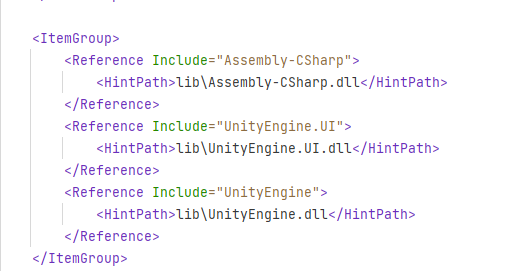
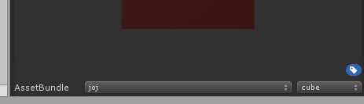
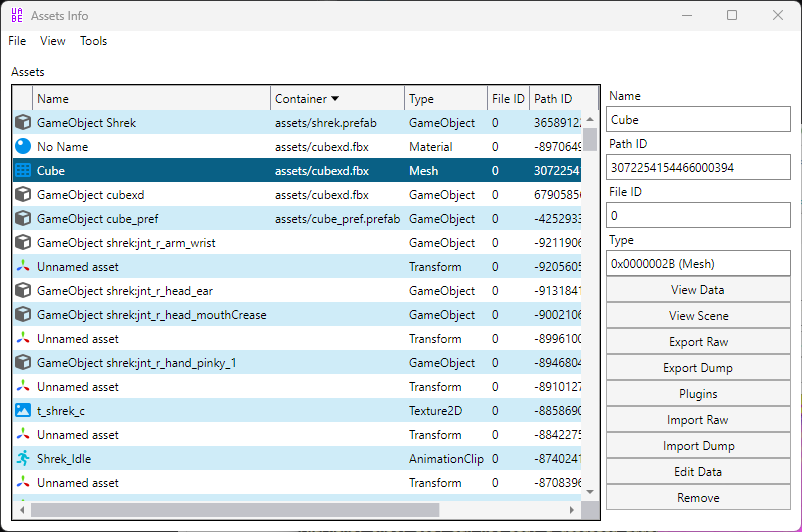
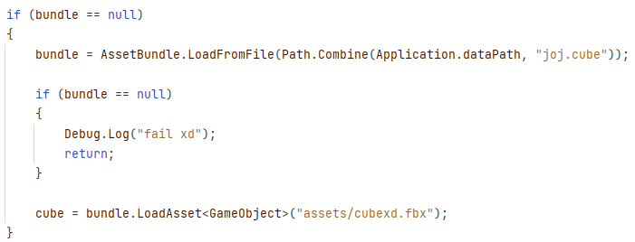

# Modding Toree3D  

## 🇫🇷 French Only -- may translate later 
   
ça fait longtemps que je voulais m'essayer à modder des jeux, pour x ou y raison   
y'a pas longtemps Arnaud (yo mec) m'a parlé de BepInEx pour le modding de jeux Unity (comme Lethal Company, Valheim, etc) donc je voulais tester   
J'ai pris un jeu qui me paraissait simple et qui est cool : Toree3D   
Spoiler : c'était pas simple mdr   
   
# Outils   
La liste j'espère exhaustive de tous les outils que j'ai utilisé :    
- Unity (même version que celle utilisée pour créer le jeu (2019.2.16))   
    - Très important d'avoir la même version pour importer les assetbundle   
- BepInEx   
    - avec Harmonyx (inclus)   
    - Runtime Unity Editor   
- AssetRipper   
    - Récupération de la plupart des assets du jeu (dont les scènes pour une meilleure visu)   
- UABE Avalonia   
- Sketchfab (modèle 3D de Shrek)   
- Jetbrains DotPeek   
    - Extraction de code à partir des DLL   
- Jetbrains Rider   
    - IDE C#   
   
   
# Process   
Alors je me rappelle forcément pas de tous les détails dans l'ordre historique mais voyons voir :   
- J'installe Toree depuis Itch   
- Je copie les dossiers du jeu à part (pour avoir une copie saine du jeu à portée de main)   
- Je joue au jeu psk déjà c'est un banger et aussi pour voir ce que je pourrais changer   
- Je me renseigne sur BepInEx   
    - Je check leur github   
        - y'a pas grand chose xd   
    - Je check leur doc   
        - y'a (un peu) plus de trucs   
    - Je check la doc d'HarmonyX   
        - Y'a quasi r aussi mdrrr ça fait beaucoup là   
    - Je check la doc d'Harmoy (forké par HarmonyX)   
        - Y'a plus de trucs mais ça reste pas ouf   
    - En gros ça manque d'exemples mais globalement niveau features bah tu peux injecter du code à des fonctions déjà existantes dans le code du jeu (nice)   
- J'installe BepInEx sur ma copie du jeu   
    - Très simple y'a littéralement 3/4 fichiers à copier   
- J'allume pour voir si ça a marché   
    - Je remarque sur la doc qu'on peut activer un mode debug pour avoir une console à côté du jeu pour voir les logs (INDISPENSABLE IMO)   
    - ça marche globalement bien y'a rien d'autre à faire que de tester   
- Avec la console je récupère la version Unity utilisée pour le jeu (très important)   
- J'installe les templates de plugin BepInEx avec dotnet
   
- Je génère un template de plugin classique   
    - Je teste et ça marche bien (un message dans la console qui me dit que mon plugin a bien chargé)   
- Après ça je fonctionne à tatillon pour changer 2/3 éléments assez """simples""" pour me familiariser avec BepInEx / Harmony   
    - Je change quelques textes   
    - Quand je build le plugin il me fait chier parce que le package Unity UI est pas passé (jsp pk) donc je vais chercher le bon dll dans le dossier Toree3D\_Data que je copie du côté de mon plugin. Puis je l'importe dans le .csproj   
            
    - ça marche niquel   
- Ensuite j'utilise AssetRipper pour récupérer la blinde d'assets du jeu dans des dossiers bien rangés   
- Je créé un nouveau projet Unity avec la même version qui a été utilisée pour faire le jeu   
    - Je copie les assets rippés dans mon nouveau projet   
    - Je "corrige" les quelques erreurs de scripts (j'en ai eu 2/3 où j'ai juste supprimé le contenu je voyais rien de problématique mais Unity me faisait chier)   
    - J'ouvre quelques scènes pour voir la gueule que ça a    
- Je décide que changer des textes c'est marrant mais jouer Shrek c'est mieux   
- Mais bon déjà y'a quelques étapes avant mdr   
    - Je décide de me renseigner comment je pourrais faire spawn un cube   
        - Après moultes galères j'apprend que je peux utiliser les **[AssetBundle](https://docs.unity3d.com/ScriptReference/AssetBundle.html)**   
    - J'importe donc le default cube de Blender (merci à lui) dans Unity   
    - Je dl l'asset bundle manager officiel depuis l'asset manager d'Unity   
    - J'attribue mon asset de cube à un bundle et à un groupe   
            
    - J'ouvre l'asset bundle browser depuis `Windows > Asset Browser Bundle` et je build    
    - J'inspecte le bundle généré (.assetbundle) avec UABE Avalonia   
            
    - Ensuite dans mon code je charge le bundle et j'extrais mon asset (le "path" c'est ce qui est décrit dans la colonne "Container" de UABE   
            
        Faut faire gaffe à pas charger plus d'une fois un bundle sinon fatal error et plus rien marche, donc garder le bundle en mémoire dans une variable globale et l'utiliser comme ça (en plus comme ça tu peux l'utiliser dans plusieurs patchs (voir mon code)   
        - Voilà j'ai un cube : (lezgo)   
            
- Je dl un FBX de Shrek pas trop dégueu sur Sketchfab   
- Je l'importe dans Unity   
    - Y'a déjà quelques anims de con fournies mais elles sont bof   
    - Je créé quelques anims random avec l'animator d'unity   
- J'en fait un prefab, que j'assigne à mon bundle   
- Mêmes étapes que pour le cube   
- Je galère juste à savoir où je dois mettre le modèle, ce que j'en fais etc   
    - A un moment je trouve (yessai), c'est dans le PlayerModel du player (logique)   
    - Je remplace par mon Shrek et je désactive l'autre   
    - ça marche, j'ai un shrek statique qui se deplace à la place du poussin   
- Pour les anims c'est du détail mais en gros j'ai des variables dans l'animator de mon prefab que je trigger / change pour activer les transitions d'animation (voir le MoveController dans le plugin)   
   
   
donc au final on a un beau shrek animé à la place de Toree 👌   

